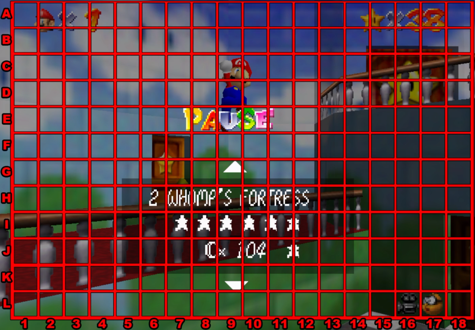

# Stream Grid

## What is a "Stream Grid"?

A Twitch streamer whom I watch a lot of, recently ran streams where they would play a game and attempt to accomplish a
specific end goal/challenge (i.e., Mario 64 Speedrun, Truck Simulator Delivery), but featuring a unique twist: viewers
could donate to place images of their choice occupying portions of a larger grid,
blocking their vision.
This content idea has made for some incredible streams, and along the way I got inspired to make this project and see if
I could make a website that would allow the process of updating the grid easier, keeping the gameplay/stream going even
if a new image got added.

### Example Grid (without images)

## Features
- Live view of current state of grid (to be used in OBS Browser Source)
  - Archive of past grids after each wipe
- Interface/application to upload new images to the grid
  - Ability to perform basic resizing, etc.
  - Handling for other actions such as wiping the grid, taking an existing piece of the grid, etc.
- Processing queue to accept/decline images (prevent images that may be against TOS)
- Interaction with the Twitch API to see if a donation was made for the grid
  - Verify that donation amount corresponds to action, number of grid spaces, etc.

## Learning Goals
- Re-familiarize myself with JavaScript and web development in general
- Learn some basic TypeScript 
- Learn the fundamentals to working with the React framework
- Get used to working with APIs
